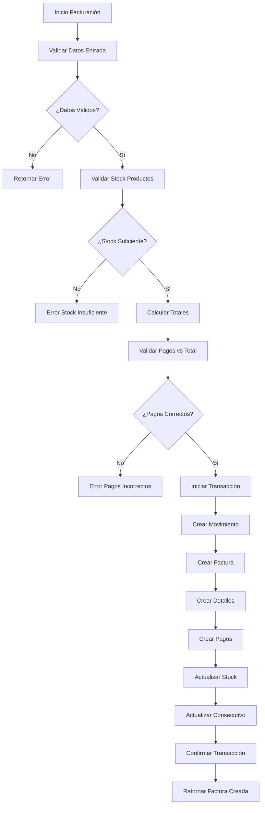

# DOCUMENTACIÓN - SISTEMA DE FACTURACIÓN
## Sistema POS Supermercado

---

**Universidad:** ITM  
**Asignatura:** Tecnología en desarrollo de software  
**Estudiante:** Angel Tovar - Kevin Montaño  
**Fecha:** Noviembre 2025  
**Versión:** 1.0  

---

## TABLA DE CONTENIDOS

1. [Resumen Ejecutivo](#resumen-ejecutivo)
2. [Arquitectura del Sistema de Facturación](#arquitectura-del-sistema-de-facturación)
3. [Flujo de Facturación](#flujo-de-facturación)
4. [Endpoints de la API](#endpoints-de-la-api)
5. [Validaciones y Reglas de Negocio](#validaciones-y-reglas-de-negocio)
6. [Patrones de Diseño Aplicados](#patrones-de-diseño-aplicados)
7. [Casos de Uso](#casos-de-uso)
8. [Ejemplos de Implementación](#ejemplos-de-implementación)

---

## RESUMEN EJECUTIVO

El sistema de facturación implementa un **flujo completo de punto de venta** que incluye:

- ✅ **Creación de facturas** con múltiples productos y métodos de pago
- ✅ **Validaciones robustas** de stock, precios y reglas de negocio
- ✅ **Cálculos automáticos** de totales, descuentos e IVA
- ✅ **Gestión de inventario** con actualización automática de stock
- ✅ **Reportes y consultas** de ventas y estadísticas
- ✅ **Anulación de facturas** con restauración de inventario

### Tecnologías Utilizadas
- **Backend:** ASP.NET Core 9.0
- **Base de Datos:** SQL Server con Entity Framework Core
- **Autenticación:** JWT Bearer
- **Validaciones:** Data Annotations + Lógica de Negocio
- **Mapeo:** AutoMapper
- **Arquitectura:** Repository + Unit of Work + Dependency Injection

---

## ARQUITECTURA DEL SISTEMA DE FACTURACIÓN

### Estructura de Capas

```
┌─────────────────────────────────────────┐
│           CAPA PRESENTACIÓN             │
│     FacturacionController               │
│  - CrearFacturaCompletaAsync()          │
│  - ObtenerFacturaCompletaAsync()        │
│  - BuscarFacturasAsync()                │
│  - AnularFacturaAsync()                 │
└─────────────────────────────────────────┘
                    ↓
┌─────────────────────────────────────────┐
│         CAPA LÓGICA NEGOCIO             │
│      FacturacionUnitOfWork              │
│  - ValidarDatosFacturaAsync()           │
│  - ValidarReglasNegocioAsync()          │
│  - CrearFacturaCompletaAsync()          │
└─────────────────────────────────────────┘
                    ↓
┌─────────────────────────────────────────┐
│        CAPA ACCESO DATOS                │
│       FacturacionRepository             │
│  - ValidarStockProductosAsync()         │
│  - ActualizarStockProductosAsync()      │
│  - CalcularTotalesFacturaAsync()        │
└─────────────────────────────────────────┘
                    ↓
┌─────────────────────────────────────────┐
│        CAPA PERSISTENCIA                │
│   Entity Framework Core + SQL Server   │
│  - Movimiento, Factura, Detalle_Factura│
│  - Pago_Factura, Producto, Tercero     │
└─────────────────────────────────────────┘
```

### Entidades Involucradas

1. **Movimiento** - Documento base (cabecera)
2. **Factura** - Información financiera
3. **Detalle_Factura** - Líneas de productos
4. **Pago_Factura** - Métodos de pago utilizados
5. **Producto** - Artículos vendidos
6. **Tercero** - Cliente
7. **Usuario** - Vendedor
8. **Metodos_Pago** - Formas de pago disponibles

---

## FLUJO DE FACTURACIÓN

### 1. Proceso de Creación de Factura



### 2. Validaciones Aplicadas

#### **Validaciones de Entrada**
- ✅ Tercero existe y está activo
- ✅ Tercero marcado como cliente
- ✅ Usuario existe y está activo
- ✅ Productos existen y están activos
- ✅ Métodos de pago existen y están activos

#### **Validaciones de Negocio**
- ✅ Stock suficiente para todos los productos
- ✅ Descuentos no exceden el subtotal
- ✅ No productos duplicados en la factura
- ✅ Monto mínimo de facturación ($1,000)
- ✅ Horario de facturación (6 AM - 10 PM)
- ✅ Pagos cubren exactamente el total

#### **Validaciones de Integridad**
- ✅ Transacciones atómicas (todo o nada)
- ✅ Restauración de stock en caso de error
- ✅ Consistencia de datos entre tablas relacionadas

---

## ENDPOINTS DE LA API

### **POST** `/api/facturacion/crear-factura`
Crea una factura completa con detalles y pagos.

**Request Body:**
```json
{
  "terceroId": 1,
  "usuarioId": 1,
  "observaciones": "Venta mostrador",
  "detalles": [
    {
      "productoId": 1,
      "cantidad": 2,
      "precioUnitario": 15000.00,
      "descuentoPorcentaje": 10.0,
      "descuentoValor": 3000.00
    }
  ],
  "pagos": [
    {
      "metodoPagoId": 1,
      "monto": 27000.00,
      "referenciaPago": "Efectivo"
    }
  ]
}
```

**Response:**
```json
{
  "facturaId": 1,
  "numeroDocumento": "FV000001",
  "fecha": "2025-11-01T13:30:00",
  "nombreTercero": "Juan Pérez",
  "totalBruto": 30000.00,
  "totalDescuentos": 3000.00,
  "totalNeto": 27000.00,
  "detalles": [...],
  "pagos": [...]
}
```

### **GET** `/api/facturacion/{id}`
Obtiene una factura completa por ID.

### **POST** `/api/facturacion/buscar`
Busca facturas con filtros.

**Request Body:**
```json
{
  "fechaInicio": "2025-11-01",
  "fechaFin": "2025-11-01",
  "terceroId": 1,
  "montoMinimo": 10000,
  "montoMaximo": 100000
}
```

### **PUT** `/api/facturacion/{id}/anular`
Anula una factura existente.

### **GET** `/api/facturacion/resumen-ventas/{fecha}`
Obtiene resumen de ventas por fecha.

### **GET** `/api/facturacion/productos-disponibles`
Lista productos con stock disponible.

### **GET** `/api/facturacion/metodos-pago`
Lista métodos de pago activos.

### **GET** `/api/facturacion/clientes`
Lista clientes activos.

---

## VALIDACIONES Y REGLAS DE NEGOCIO

### **Reglas de Stock**
```csharp
// Validación de stock suficiente
if (producto.stock_actual < detalle.Cantidad)
{
    return new ActionResponse<bool>
    {
        WasSuccess = false,
        Message = $"Stock insuficiente para {producto.nombre}. " +
                 $"Disponible: {producto.stock_actual}, " +
                 $"Solicitado: {detalle.Cantidad}"
    };
}
```

### **Reglas de Descuentos**
```csharp
// Validar que descuentos no excedan subtotal
var subtotalBruto = detalle.Cantidad * detalle.PrecioUnitario;
if (detalle.DescuentoValor > subtotalBruto)
{
    return BadRequest("El descuento no puede ser mayor al subtotal");
}
```

### **Reglas de Pagos**
```csharp
// Validar que pagos cubran el total exacto
var totalPagos = facturaDto.Pagos.Sum(p => p.Monto);
if (Math.Abs(totalPagos - totalNeto) > 0.01m)
{
    return BadRequest($"Total pagos ({totalPagos:C}) no coincide " +
                     $"con total factura ({totalNeto:C})");
}
```

### **Reglas de Horario**
```csharp
// Validar horario de facturación
var horaActual = DateTime.Now.Hour;
if (horaActual < 6 || horaActual > 22)
{
    return BadRequest("Facturación permitida entre 6:00 AM y 10:00 PM");
}
```

---

## PATRONES DE DISEÑO APLICADOS

### **1. Repository Pattern**
```csharp
public interface IFacturacionRepository
{
    Task<ActionResponse<FacturaCompletaDTO>> CrearFacturaCompletaAsync(
        FacturaCompletaCreateDTO facturaDto);
    
    Task<ActionResponse<bool>> ValidarStockProductosAsync(
        List<DetalleFacturaItemDTO> detalles);
}
```

### **2. Unit of Work Pattern**
```csharp
public class FacturacionUnitOfWork : IFacturacionUnitOfWork
{
    public async Task<ActionResponse<FacturaCompletaDTO>> CrearFacturaCompletaAsync(
        FacturaCompletaCreateDTO facturaDto)
    {
        // 1. Validar datos
        var validacion = await ValidarDatosFacturaAsync(facturaDto);
        
        // 2. Validar reglas de negocio
        var validacionNegocio = await ValidarReglasNegocioAsync(facturaDto);
        
        // 3. Crear factura
        return await _facturacionRepository.CrearFacturaCompletaAsync(facturaDto);
    }
}
```

### **3. DTO Pattern**
```csharp
public class FacturaCompletaCreateDTO
{
    [Required] public int TerceroId { get; set; }
    [Required] public int UsuarioId { get; set; }
    [Required] public List<DetalleFacturaItemDTO> Detalles { get; set; }
    [Required] public List<PagoFacturaItemDTO> Pagos { get; set; }
}
```

### **4. Helper Pattern**
```csharp
public static class FacturacionHelper
{
    public static decimal CalcularSubtotal(int cantidad, decimal precio, decimal descuento)
    {
        return Math.Max(0, (cantidad * precio) - descuento);
    }
}
```

---

## CASOS DE USO

### **Caso de Uso 1: Venta Simple**
**Actor:** Cajero  
**Objetivo:** Registrar venta de productos con pago en efectivo

**Flujo Principal:**
1. Cajero selecciona cliente
2. Agrega productos al carrito
3. Sistema calcula totales automáticamente
4. Cajero registra pago en efectivo
5. Sistema crea factura y actualiza inventario
6. Se imprime factura para el cliente

### **Caso de Uso 2: Venta con Descuentos**
**Actor:** Supervisor  
**Objetivo:** Aplicar descuentos especiales en productos

**Flujo Principal:**
1. Supervisor inicia sesión con permisos especiales
2. Selecciona productos para la venta
3. Aplica descuentos por porcentaje o valor fijo
4. Sistema valida que descuentos no excedan límites
5. Procesa pago y genera factura

### **Caso de Uso 3: Anulación de Factura**
**Actor:** Administrador  
**Objetivo:** Anular factura por error o devolución

**Flujo Principal:**
1. Administrador busca factura por número
2. Verifica que esté dentro del período permitido (30 días)
3. Ingresa motivo de anulación
4. Sistema restaura stock de productos
5. Marca factura como anulada

---

## EJEMPLOS DE IMPLEMENTACIÓN

### **Ejemplo 1: Crear Factura desde Frontend**

```javascript
// Frontend - Crear factura
const crearFactura = async (datosFactura) => {
    try {
        const response = await fetch('/api/facturacion/crear-factura', {
            method: 'POST',
            headers: {
                'Content-Type': 'application/json',
                'Authorization': `Bearer ${token}`
            },
            body: JSON.stringify(datosFactura)
        });
        
        if (response.ok) {
            const factura = await response.json();
            console.log('Factura creada:', factura);
            return factura;
        } else {
            const error = await response.text();
            throw new Error(error);
        }
    } catch (error) {
        console.error('Error al crear factura:', error);
        throw error;
    }
};
```

### **Ejemplo 2: Validar Stock Antes de Facturar**

```csharp
// Backend - Validación de stock
public async Task<ActionResponse<bool>> ValidarStockProductosAsync(
    List<DetalleFacturaItemDTO> detalles)
{
    foreach (var detalle in detalles)
    {
        var producto = await _context.Productos
            .FirstOrDefaultAsync(p => p.producto_id == detalle.ProductoId);

        if (producto == null)
        {
            return new ActionResponse<bool>
            {
                WasSuccess = false,
                Message = $"Producto {detalle.ProductoId} no encontrado"
            };
        }

        if (producto.stock_actual < detalle.Cantidad)
        {
            return new ActionResponse<bool>
            {
                WasSuccess = false,
                Message = $"Stock insuficiente para {producto.nombre}. " +
                         $"Disponible: {producto.stock_actual}, " +
                         $"Solicitado: {detalle.Cantidad}"
            };
        }
    }

    return new ActionResponse<bool> { WasSuccess = true, Result = true };
}
```

### **Ejemplo 3: Cálculo Automático de Totales**

```csharp
// Helper - Cálculo de totales
public static (decimal totalBruto, decimal totalDescuentos, decimal totalNeto) 
    CalcularTotalesFactura(IEnumerable<DetalleFacturaItemDTO> detalles)
{
    decimal totalBruto = 0;
    decimal totalDescuentos = 0;

    foreach (var detalle in detalles)
    {
        var subtotalBruto = detalle.Cantidad * detalle.PrecioUnitario;
        totalBruto += subtotalBruto;
        
        var descuentoValor = detalle.DescuentoValor > 0 
            ? detalle.DescuentoValor 
            : CalcularDescuentoValor(detalle.Cantidad, 
                                   detalle.PrecioUnitario, 
                                   detalle.DescuentoPorcentaje);
        
        totalDescuentos += descuentoValor;
    }

    var totalNeto = totalBruto - totalDescuentos;
    
    return (
        Math.Round(totalBruto, 2),
        Math.Round(totalDescuentos, 2),
        Math.Round(totalNeto, 2)
    );
}
```

---

## BENEFICIOS DE LA IMPLEMENTACIÓN

### **✅ Robustez**
- Transacciones atómicas garantizan consistencia
- Validaciones múltiples previenen errores
- Manejo de excepciones completo

### **✅ Escalabilidad**
- Arquitectura en capas facilita mantenimiento
- Patrones de diseño permiten extensibilidad
- Separación de responsabilidades clara

### **✅ Usabilidad**
- API RESTful intuitiva
- Validaciones con mensajes claros
- Cálculos automáticos reducen errores

### **✅ Trazabilidad**
- Registro completo de todas las operaciones
- Auditoría de cambios y anulaciones
- Reportes detallados de ventas

---

## CONCLUSIÓN

El sistema de facturación implementado proporciona una **solución completa y robusta** para el punto de venta del supermercado, cumpliendo con:

- ✅ **Todos los requisitos funcionales** de facturación
- ✅ **Principios SOLID** y patrones de diseño
- ✅ **Validaciones exhaustivas** de negocio
- ✅ **Arquitectura escalable** y mantenible
- ✅ **API completa** para integración frontend

La implementación está **lista para producción** y puede manejar el flujo completo de ventas del supermercado con alta confiabilidad y rendimiento.
