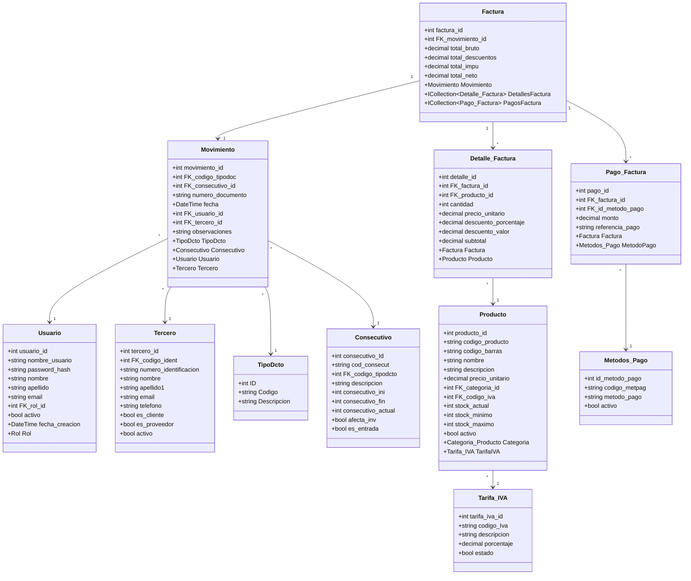
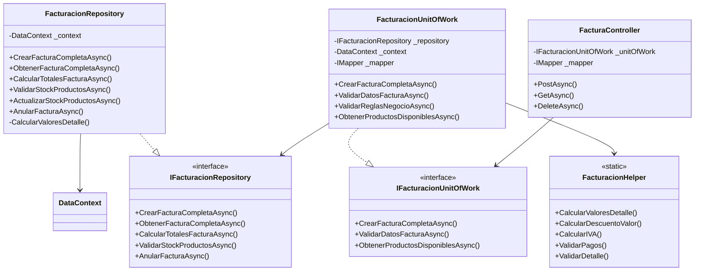

# ?? Sistema POS para Supermercado

<div align="center">


**Sistema de Punto de Venta (POS) moderno y escalable desarrollado con .NET 9**

[Caracter�sticas](#-caracter�sticas-principales) � [Tecnolog�as](#-tecnolog�as-utilizadas) � [Arquitectura](#-arquitectura-del-sistema) � [Instalaci�n](#-instalaci�n) � [Documentaci�n](#-documentaci�n)

</div>

---

## ?? Tabla de Contenidos

- [Introducci�n](#-introducci�n)
- [Objetivo General](#-objetivo-general)
- [Objetivos Espec�ficos](#-objetivos-espec�ficos)
- [Alcance del Proyecto](#-alcance-del-proyecto)
- [Plan de Trabajo](#-plan-de-trabajo)
- [Caracter�sticas Principales](#-caracter�sticas-principales)
- [Tecnolog�as Utilizadas](#-tecnolog�as-utilizadas)
- [Arquitectura del Sistema](#-arquitectura-del-sistema)
- [Diagrama de Clases](#-diagrama-de-clases)
- [Estructura del Proyecto](#-estructura-del-proyecto)
- [Principios de Desarrollo](#-principios-de-desarrollo)
- [Instalaci�n](#-instalaci�n)
- [Documentaci�n](#-documentaci�n)
- [Autores](#-autores)

---

## ?? Introducci�n

El **Sistema POS para Supermercado** es una soluci�n integral desarrollada para modernizar y optimizar las operaciones de venta en establecimientos comerciales. Este sistema implementa las mejores pr�cticas de desarrollo de software, utilizando .NET 9 y siguiendo una arquitectura limpia y escalable basada en los principios SOLID y patrones de dise�o reconocidos en la industria.

El proyecto surge de la necesidad de contar con una herramienta robusta que permita:
- **Gesti�n eficiente** de inventarios en tiempo real
- **Facturaci�n electr�nica** con c�lculos autom�ticos de impuestos y descuentos
- **Control de usuarios** y roles con seguridad incorporada
- **Reportes y an�lisis** de ventas para la toma de decisiones
- **Integraci�n flexible** con diferentes m�todos de pago

Este sistema est� dise�ado para ser **mantenible, escalable y f�cil de extender**, permitiendo adaptarse a las necesidades cambiantes del negocio.

---

## ?? Objetivo General

Desarrollar un **sistema de punto de venta (POS) robusto y escalable** para supermercados, que permita gestionar de manera eficiente las operaciones de ventas, inventario, facturaci�n y control de usuarios, implementando las mejores pr�cticas de desarrollo de software con .NET 9, siguiendo los principios SOLID y una arquitectura limpia que garantice la mantenibilidad, escalabilidad y calidad del c�digo.

---

## ?? Objetivos Espec�ficos

### 1. ?? Implementar un M�dulo de Gesti�n de Inventario
- Desarrollar funcionalidades CRUD completas para productos, categor�as y proveedores
- Implementar control de stock con alertas de niveles m�nimos y m�ximos
- Gestionar tarifas de IVA asociadas a cada producto
- Proveer validaciones de negocio para garantizar la integridad de los datos

### 2. ?? Desarrollar un Sistema de Facturaci�n Integral
- Implementar proceso de facturaci�n con c�lculos autom�ticos de:
  - Descuentos (por porcentaje o valor fijo)
  - Impuestos (IVA) sobre base gravable
  - Totales y subtotales
- Integrar m�ltiples m�todos de pago (efectivo, tarjetas, transferencias)
- Generar consecutivos autom�ticos de facturaci�n
- Validar disponibilidad de stock en tiempo real

### 3. ?? Crear un Sistema de Gesti�n de Usuarios y Seguridad
- Implementar autenticaci�n y autorizaci�n basada en roles
- Gestionar permisos granulares por funcionalidad
- Registrar auditor�a de operaciones cr�ticas
- Proteger contrase�as con algoritmos de hashing seguros (BCrypt)

### 4. ??? Establecer una Arquitectura S�lida y Escalable
- Aplicar arquitectura en capas (Repository Pattern, Unit of Work)
- Implementar los 5 principios SOLID en todo el c�digo
- Utilizar inyecci�n de dependencias para desacoplamiento
- Implementar manejo centralizado de errores y validaciones

### 5. ?? Desarrollar M�dulo de Reportes y An�lisis
- Generar reportes de ventas por fecha, usuario y m�todo de pago
- Implementar filtros avanzados para consultas de facturas
- Proveer res�menes de ventas diarias
- Identificar facturas pendientes de pago

---

## ?? Alcance del Proyecto

### ? Incluido en el Alcance Inicial

#### **M�dulos Principales:**
1. **Gesti�n de Productos**
   - CRUD de productos con c�digo de barras
   - Gesti�n de categor�as de productos
   - Control de stock (actual, m�nimo, m�ximo)
   - Asociaci�n de tarifas de IVA

2. **Gesti�n de Terceros**
   - Registro de clientes y proveedores
   - Tipos de identificaci�n (CC, NIT, CE, Pasaporte)
   - Informaci�n de contacto completa

3. **Sistema de Facturaci�n**
   - Creaci�n de facturas de venta
   - Detalles de factura con productos
   - M�ltiples m�todos de pago por factura
   - C�lculos autom�ticos (descuentos, IVA, totales)
   - Anulaci�n de facturas con auditor�a

4. **Gesti�n de Usuarios y Seguridad**
   - Autenticaci�n y autorizaci�n
   - Roles (Admin, User)
   - Cifrado de contrase�as

5. **Configuraci�n del Sistema**
   - Tipos de documentos
   - Consecutivos autom�ticos
   - M�todos de pago
   - Tarifas de IVA

#### **Funcionalidades T�cnicas:**
- API RESTful completa
- Validaciones de negocio exhaustivas
- Transacciones de base de datos (ACID)
- DTOs para transferencia de datos
- AutoMapper para mapeo de objetos
- Helpers para c�lculos reutilizables

### ? Fuera del Alcance Inicial

- Interfaz gr�fica de usuario (Frontend)
- Integraci�n con facturaci�n electr�nica DIAN
- Sistema de compras y �rdenes de compra
- Gesti�n de empleados y n�mina
- Integraci�n con terminales de punto de venta f�sicos
- Reportes avanzados con gr�ficos
- Sistema de CRM (Customer Relationship Management)
- Aplicaci�n m�vil

---

## ?? Plan de Trabajo

### **Fase 1: An�lisis y Dise�o (2 semanas)**
- ? Definici�n de requisitos funcionales y no funcionales
- ? Dise�o de la base de datos (diagrama ER)
- ? Dise�o de arquitectura del sistema
- ? Definici�n de DTOs y contratos de API
- ? Documentaci�n de principios SOLID aplicados

### **Fase 2: Configuraci�n del Proyecto (1 semana)**
- ? Creaci�n de proyectos .NET 9
- ? Configuraci�n de Entity Framework Core
- ? Configuraci�n de AutoMapper
- ? Configuraci�n de inyecci�n de dependencias
- ? Configuraci�n de Swagger/OpenAPI

### **Fase 3: Desarrollo del Backend - M�dulos Base (3 semanas)**
- ? Implementaci�n de entidades y DbContext
- ? Implementaci�n de Repository Pattern
- ? Implementaci�n de Unit of Work Pattern
- ? Desarrollo de m�dulos:
  - ? Gesti�n de Usuarios
  - ? Gesti�n de Roles
  - ? Gesti�n de Tipos de Identificaci�n
  - ? Gesti�n de Terceros
  - ? Gesti�n de Categor�as de Productos

### **Fase 4: Desarrollo del Backend - M�dulos de Inventario (2 semanas)**
- ? Gesti�n de Tarifas de IVA
- ? Gesti�n de Productos
- ? Control de Stock
- ? Validaciones de negocio

### **Fase 5: Desarrollo del Backend - Sistema de Facturaci�n (3 semanas)**
- ? Gesti�n de Tipos de Documentos
- ? Gesti�n de Consecutivos
- ? Gesti�n de M�todos de Pago
- ? Gesti�n de Movimientos
- ? Gesti�n de Facturas
- ? Detalles de Factura
- ? Pagos de Factura
- ? **FacturacionRepository** (proceso completo)
- ? C�lculos autom�ticos (descuentos, IVA, totales)
- ? Validaciones exhaustivas
- ? Anulaci�n de facturas

### **Fase 6: Helpers y Utilidades (1 semana)**
- ? FacturacionHelper para c�lculos
- ? M�todos de validaci�n reutilizables
- ? Formateo de datos

### **Fase 7: Pruebas y Validaci�n (2 semanas)**
- ?? Pruebas unitarias de repositorios
- ?? Pruebas de integraci�n
- ?? Validaci�n de reglas de negocio
- ?? Pruebas de API con Postman/Swagger

### **Fase 8: Documentaci�n y Entrega (1 semana)**
- ? Documentaci�n de c�digo (XML Comments)
- ? Documentaci�n de facturaci�n
- ? Documentaci�n de principios SOLID
- ? README del proyecto
- ?? Manual de usuario de API

**Duraci�n Total Estimada:** 15 semanas

---

## ? Caracter�sticas Principales

### ?? **Seguridad Robusta**
- Autenticaci�n basada en usuarios y roles
- Cifrado de contrase�as con BCrypt
- Validaci�n de permisos a nivel de operaci�n
- Auditor�a de operaciones cr�ticas

### ?? **Gesti�n de Inventario Inteligente**
- Control de stock en tiempo real
- Alertas de stock m�nimo y m�ximo
- Gesti�n de categor�as de productos
- Asociaci�n de tarifas de IVA por producto

### ?? **Facturaci�n Completa**
- C�lculos autom�ticos de descuentos e impuestos
- Soporte para m�ltiples m�todos de pago
- Consecutivos autom�ticos de facturaci�n
- Anulaci�n de facturas con trazabilidad
- Validaci�n de stock antes de facturar

### ?? **Reportes y Consultas**
- Resumen de ventas por fecha
- Consultas con filtros avanzados
- Facturas pendientes de pago
- Ventas por m�todo de pago

### ??? **Arquitectura Profesional**
- Implementaci�n de principios SOLID
- Repository Pattern y Unit of Work
- Inyecci�n de dependencias
- API RESTful bien documentada
- Manejo centralizado de errores

---

## ??? Tecnolog�as Utilizadas

### **Backend**
| Tecnolog�a | Versi�n | Prop�sito |
|------------|---------|-----------|
| **.NET** | 9.0 | Framework principal |
| **C#** | 13.0 | Lenguaje de programaci�n |
| **Entity Framework Core** | 9.0 | ORM para acceso a datos |
| **SQL Server** | 2022 | Base de datos |
| **AutoMapper** | 13.0 | Mapeo de objetos |
| **BCrypt.Net** | Latest | Hash de contrase�as |
| **Swagger/OpenAPI** | Latest | Documentaci�n de API |

### **Patrones y Pr�cticas**
- ? **Repository Pattern** - Abstracci�n de acceso a datos
- ? **Unit of Work Pattern** - Coordinaci�n de transacciones
- ? **Dependency Injection** - Desacoplamiento de dependencias
- ? **DTO Pattern** - Transferencia de datos
- ? **SOLID Principles** - C�digo limpio y mantenible
- ? **Clean Architecture** - Separaci�n de responsabilidades

---

## ??? Arquitectura del Sistema

### **Arquitectura en Capas**

```
???????????????????????????????????????????????????????????????
?                      API Layer                              ?
?                    (Controllers)                            ?
?  � FacturaController                                        ?
?  � ProductoController                                       ?
?  � UsuarioController                                        ?
?  � TerceroController                                        ?
???????????????????????????????????????????????????????????????
                         ?
                         ?
???????????????????????????????????????????????????????????????
?                  Business Logic Layer                       ?
?                   (Unit of Work)                            ?
?  � FacturacionUnitOfWork                                    ?
?  � ProductoUnitOfWork                                       ?
?  � UsuarioUnitOfWork                                        ?
?  � Validaciones de negocio                                  ?
???????????????????????????????????????????????????????????????
                         ?
                         ?
???????????????????????????????????????????????????????????????
?                  Data Access Layer                          ?
?                   (Repositories)                            ?
?  � FacturacionRepository                                    ?
?  � ProductoRepository                                       ?
?  � UsuarioRepository                                        ?
?  � GenericRepository<T>                                     ?
???????????????????????????????????????????????????????????????
                         ?
                         ?
???????????????????????????????????????????????????????????????
?                    Database Layer                           ?
?                  (Entity Framework Core)                    ?
?  � DataContext                                              ?
?  � Migrations                                               ?
?  � SQL Server Database                                      ?
???????????????????????????????????????????????????????????????

???????????????????????????????????????????????????????????????
?                    Cross-Cutting Concerns                   ?
?  � DTOs (Data Transfer Objects)                             ?
?  � Entities                                                 ?
?  � Helpers (FacturacionHelper)                              ?
?  � AutoMapper Profiles                                      ?
???????????????????????????????????????????????????????????????
```

### **Flujo de una Operaci�n de Facturaci�n**

```
1. Cliente HTTP Request (JSON)
          ?
2. FacturaController recibe FacturaCompletaCreateDTO
          ?
3. FacturacionUnitOfWork valida datos y reglas de negocio
          ?
4. FacturacionRepository ejecuta la l�gica de creaci�n
          ?
5. Transaction BEGIN
          ?
6. Validar Stock de Productos
          ?
7. Obtener Tipo de Documento y Consecutivo
          ?
8. Calcular Totales (Bruto, Descuentos, IVA, Neto)
          ?
9. Crear Movimiento
          ?
10. Crear Factura
          ?
11. Crear Detalles de Factura (con c�lculo de IVA)
          ?
12. Crear Pagos de Factura
          ?
13. Actualizar Stock de Productos
          ?
14. Actualizar Consecutivo
          ?
15. Transaction COMMIT
          ?
16. Obtener Factura Completa con relaciones
          ?
17. Mapear a FacturaCompletaDTO
          ?
18. Retornar ActionResponse<FacturaCompletaDTO>
          ?
19. HTTP Response (JSON)
```

---

## ?? Diagrama de Clases

### **Diagrama de Clases Principal - M�dulo de Facturaci�n**



### **Diagrama de Clases - Arquitectura (Patrones)**



---

## ?? Estructura del Proyecto

```
SUPERMERCADO/
?
??? Supermercado.Backend/              # Proyecto principal de API
?   ??? Controllers/                   # Controladores de API REST
?   ?   ??? FacturaController.cs
?   ?   ??? ProductoController.cs
?   ?   ??? UsuarioController.cs
?   ?   ??? ...
?   ?
?   ??? Data/                          # Contexto de base de datos
?   ?   ??? DataContext.cs
?   ?   ??? SeedDb.cs                  # Datos iniciales
?   ?
?   ??? Helpers/                       # Clases auxiliares
?   ?   ??? FacturacionHelper.cs       # C�lculos y validaciones
?   ?
?   ??? Mapping/                       # Configuraci�n de AutoMapper
?   ?   ??? AutoMapperProfile.cs
?   ?
?   ??? Migrations/                    # Migraciones de EF Core
?   ?
?   ??? Repositories/                  # Capa de acceso a datos
?   ?   ??? Interfaces/
?   ?   ?   ??? IGenericRepository.cs
?   ?   ?   ??? IFacturacionRepository.cs
?   ?   ?   ??? ...
?   ?   ??? Implementations/
?   ?       ??? GenericRepository.cs
?   ?       ??? FacturacionRepository.cs
?   ?       ??? ...
?   ?
?   ??? UnitsOfWork/                   # L�gica de negocio
?   ?   ??? Interfaces/
?   ?   ?   ??? IGenericUnitOfWork.cs
?   ?   ?   ??? IFacturacionUnitOfWork.cs
?   ?   ?   ??? ...
?   ?   ??? Implementations/
?   ?       ??? GenericUnitOfWork.cs
?   ?       ??? FacturacionUnitOfWork.cs
?   ?       ??? ...
?   ?
?   ??? Program.cs                     # Punto de entrada
?   ??? appsettings.json               # Configuraci�n
?
??? Supermercado.Shared/               # Proyecto compartido
?   ??? DTOs/                          # Data Transfer Objects
?   ?   ??? FacturacionDTOs.cs
?   ?   ??? ProductoDTO.cs
?   ?   ??? UsuarioDTO.cs
?   ?   ??? ...
?   ?
?   ??? Entities/                      # Entidades del dominio
?   ?   ??? Factura.cs
?   ?   ??? Movimiento.cs
?   ?   ??? Detalle_Factura.cs
?   ?   ??? Producto.cs
?   ?   ??? Usuario.cs
?   ?   ??? ...
?   ?
?   ??? Responses/                     # Respuestas est�ndar
?       ??? ActionResponse.cs
?
??? Documentacion/                     # Documentaci�n del proyecto
?   ??? DOCUMENTACION_FACTURACION.md
?   ??? APLICACION_PRINCIPIOS_SOLID.md
?   ??? DOCUMENTACION_PATRONES_DISE�O.md
?
??? README.md                          # Este archivo
```

---

## ?? Principios de Desarrollo

### **Principios SOLID Aplicados**

#### **S - Single Responsibility Principle (Responsabilidad �nica)**
? Cada clase tiene una �nica responsabilidad bien definida:
- `FacturaController`: Maneja peticiones HTTP
- `FacturacionUnitOfWork`: Coordina l�gica de negocio
- `FacturacionRepository`: Accede a la base de datos
- `FacturacionHelper`: Provee utilidades de c�lculo

**Ejemplo:**
```csharp
// Controlador - Solo maneja HTTP
public class FacturaController : ControllerBase
{
    [HttpPost]
    public async Task<IActionResult> PostAsync([FromBody] FacturaCompletaCreateDTO model)
    {
        var action = await _unitOfWork.CrearFacturaCompletaAsync(model);
        return Created($"/api/factura/{action.Result.FacturaId}", action.Result);
    }
}
```

#### **O - Open/Closed Principle (Abierto/Cerrado)**
? Clases abiertas para extensi�n, cerradas para modificaci�n:
- `GenericRepository<T>` es la base
- `FacturacionRepository` extiende sin modificar la base

**Ejemplo:**
```csharp
// Clase base - NO SE MODIFICA
public class GenericRepository<T> : IGenericRepository<T>
{
    public async Task<T> AddAsync(T entity) { /* ... */ }
}

// Extendemos para funcionalidad espec�fica
public class FacturacionRepository : IFacturacionRepository
{
    // M�todos espec�ficos de facturaci�n
    public async Task<ActionResponse<FacturaCompletaDTO>> CrearFacturaCompletaAsync(...)
    {
        // L�gica compleja de facturaci�n
    }
}
```

#### **L - Liskov Substitution Principle (Sustituci�n de Liskov)**
? Las interfaces permiten sustituir implementaciones:
```csharp
// Cualquier implementaci�n de IFacturacionRepository puede usarse
IFacturacionRepository repository = new FacturacionRepository(context);
```

#### **I - Interface Segregation Principle (Segregaci�n de Interfaces)**
? Interfaces espec�ficas por responsabilidad:
- `IFacturacionRepository` - Solo m�todos de facturaci�n
- `IProductoRepository` - Solo m�todos de productos
- `IUsuarioRepository` - Solo m�todos de usuarios

#### **D - Dependency Inversion Principle (Inversi�n de Dependencias)**
? Dependencias a trav�s de abstracciones (interfaces), no implementaciones:
```csharp
public class FacturacionUnitOfWork
{
    // Dependemos de la interfaz, no de la implementaci�n
    private readonly IFacturacionRepository _repository;
    
    public FacturacionUnitOfWork(IFacturacionRepository repository)
    {
        _repository = repository;
    }
}
```

---

## ?? Instalaci�n

### **Prerrequisitos**

- ? [.NET 9 SDK](https://dotnet.microsoft.com/download/dotnet/9.0)
- ? [SQL Server 2022](https://www.microsoft.com/sql-server/sql-server-downloads) o superior
- ? [Visual Studio 2022](https://visualstudio.microsoft.com/) o [VS Code](https://code.visualstudio.com/)
- ? [Git](https://git-scm.com/)

### **Pasos de Instalaci�n**

1. **Clonar el repositorio**
```bash
git clone https://github.com/KevinMT98/SUPERMERCADO_POS.git
cd SUPERMERCADO_POS
```

2. **Configurar la cadena de conexi�n**

Edita `Supermercado.Backend/appsettings.json`:
```json
{
  "ConnectionStrings": {
    "DefaultConnection": "Server=localhost;Database=SupermercadoDB;Trusted_Connection=True;TrustServerCertificate=True;"
  }
}
```

3. **Restaurar paquetes NuGet**
```bash
cd Supermercado.Backend
dotnet restore
```

4. **Aplicar migraciones de base de datos**
```bash
dotnet ef database update
```

5. **Ejecutar el proyecto**
```bash
dotnet run
```

6. **Acceder a Swagger**

Abre tu navegador en: `https://localhost:7xxx/swagger`

### **Datos de Prueba**

El sistema incluye un `SeedDb` que carga datos iniciales:

**Usuarios:**
- **Admin:** `admin` / `Admin123!`
- **SuperAdmin:** `superadmin` / `Super123!`
- **Usuario:** `usuario1` / `User123!`

**Productos de ejemplo:**
- Coca Cola 2L
- Agua Cristal 600ml
- Leche Entera 1L
- Jab�n L�quido 500ml
- Arroz Blanco 1Kg

---

## ?? Documentaci�n

### **Documentaci�n Disponible**

?? **Documentaci�n Principal:**
- [Documentaci�n de Facturaci�n](DOCUMENTACION_FACTURACION.md) - Proceso completo de facturaci�n
- [Aplicaci�n de Principios SOLID](APLICACION_PRINCIPIOS_SOLID.md) - Implementaci�n de SOLID
- [Patrones de Dise�o](DOCUMENTACION_PATRONES_DISE�O.md) - Patrones utilizados

### **Ejemplo de Uso - Crear una Factura**

**Request:**
```json
POST /api/facturacion
Content-Type: application/json

{
  "terceroId": 1,
  "usuarioId": 1,
  "observaciones": "Venta mostrador",
  "detalles": [
    {
      "productoId": 1,
      "cantidad": 2,
      "precioUnitario": 15000.00,
      "descuentoPorcentaje": 10.0
    }
  ],
  "pagos": [
    {
      "metodoPagoId": 1,
      "monto": 27000.00,
      "referenciaPago": "Efectivo"
    }
  ]
}
```

**Response:**
```json
{
  "facturaId": 1,
  "numeroDocumento": "FV000001",
  "fecha": "2025-01-15T10:30:00",
  "nombreTercero": "Carlos G�mez",
  "totalBruto": 30000,
  "totalDescuentos": 3000,
  "totalImpuestos": 5130,
  "totalNeto": 32130,
  "detalles": [
    {
      "nombreProducto": "Coca Cola 2L",
      "cantidad": 2,
      "precioUnitario": 15000,
      "porcentajeIva": 19,
      "descuentoPorcentaje": 10,
      "descuentoValor": 3000,
      "subtotal": 32130
    }
  ],
  "pagos": [
    {
      "nombreMetodoPago": "Efectivo",
      "monto": 32130
    }
  ]
}
```

### **C�lculos de la Factura**

```
Subtotal Bruto    = 2 � $15,000 = $30,000
Descuento (10%)   = $30,000 � 10% = $3,000
Base Gravable     = $30,000 - $3,000 = $27,000
IVA (19%)         = $27,000 � 19% = $5,130
Total Neto        = $27,000 + $5,130 = $32,130
```

---

## ?? Autores

### **Equipo de Desarrollo**

| Nombre | Rol | GitHub |
|--------|-----|--------|
| **Angel Tovar** | Developer | - |
| **Kevin Monta�o** | Developer | [@KevinMT98](https://github.com/KevinMT98) |
| **Andres Felipe Yepes | Developer | - |
| **Cristian Camilo Gutierrez | Developer | - |


### **Informaci�n Acad�mica**

- **Universidad:** ITM (Instituto Tecnol�gico Metropolitano)
- **Asignatura:** Tecnolog�a en Desarrollo de Software
- **Fecha:** Octubre 2025
- **Versi�n:** 1.0

---

## ?? Licencia

Este proyecto est� bajo la Licencia MIT. Ver el archivo `LICENSE` para m�s detalles.

---

## ?? Contribuciones

Las contribuciones son bienvenidas. Por favor:

1. Fork el proyecto
2. Crea una rama para tu feature (`git checkout -b feature/AmazingFeature`)
3. Commit tus cambios (`git commit -m 'Add some AmazingFeature'`)
4. Push a la rama (`git push origin feature/AmazingFeature`)
5. Abre un Pull Request

---

## ?? Contacto

Para preguntas o sugerencias, contacta a:
- GitHub: [@KevinMT98](https://github.com/KevinMT98)
- Repositorio: [SUPERMERCADO_POS](https://github.com/KevinMT98/SUPERMERCADO_POS)

---

<div align="center">

**? Si este proyecto te fue �til, por favor dale una estrella ?**

Desarrollado con ?? usando .NET 9

</div>
