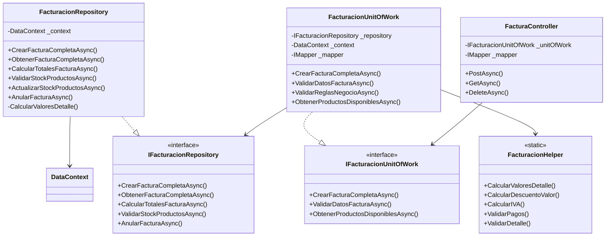

# 🛒 Sistema POS para Supermercado

<div align="center">


**Sistema de Punto de Venta (POS) moderno y escalable desarrollado con .NET 9**

[Características](#-características-principales) • [Tecnologías](#️-tecnologías-utilizadas) • [Arquitectura](#-arquitectura-del-sistema) • [Instalación](#-instalación) • [Documentación](#-documentación)

</div>

---

## 📑 Tabla de Contenidos

- [Introducción](#-introducción)
- [Objetivos del Proyecto](#-objetivos-del-proyecto)
  - [Objetivo General](#objetivo-general)
  - [Objetivos Específicos](#objetivos-específicos)
- [Alcance del Proyecto](#-alcance-del-proyecto)
- [Características Principales](#-características-principales)
- [Tecnologías Utilizadas](#️-tecnologías-utilizadas)
- [Arquitectura del Sistema](#-arquitectura-del-sistema)
  - [Arquitectura en Capas](#arquitectura-en-capas)
  - [ORM y Documentación de API](#-manejo-de-orm-y-documentación-de-api)
  - [Diagrama de Clases](#-diagrama-de-clases)
- [Estructura del Proyecto](#-estructura-del-proyecto)
- [Principios de Desarrollo](#-principios-de-desarrollo)
- [Instalación y Configuración](#-instalación-y-configuración)
- [Uso del Sistema](#-uso-del-sistema)
- [Plan de Trabajo](#-plan-de-trabajo)
- [Documentación Técnica](#-documentación-técnica)
- [Contribuciones](#-contribuciones)
- [Autores](#-autores)
- [Licencia](#-licencia)

---

## 📖 Introducción

El **Sistema POS para Supermercado** es una solución integral desarrollada para modernizar y optimizar las operaciones de venta en establecimientos comerciales. Este sistema implementa las mejores prácticas de desarrollo de software, utilizando .NET 9 y siguiendo una arquitectura limpia y escalable basada en los principios SOLID y patrones de diseño reconocidos en la industria.

### ¿Por qué este sistema?

El proyecto surge de la necesidad de contar con una herramienta robusta que permita:

- ✅ **Gestión eficiente** de inventarios en tiempo real
- ✅ **Facturación completa** con cálculos automáticos de impuestos y descuentos
- ✅ **Control de usuarios** y roles con seguridad incorporada
- ✅ **Reportes y análisis** de ventas para la toma de decisiones
- ✅ **Integración flexible** con diferentes métodos de pago

Este sistema está diseñado para ser **mantenible, escalable y fácil de extender**, permitiendo adaptarse a las necesidades cambiantes del negocio.

---

## 🎯 Objetivos del Proyecto

### Objetivo General

Desarrollar un **sistema de punto de venta (POS) robusto y escalable** para supermercados, que permita gestionar de manera eficiente las operaciones de ventas, inventario, facturación y control de usuarios, implementando las mejores prácticas de desarrollo de software con .NET 9, siguiendo los principios SOLID y una arquitectura limpia que garantice la mantenibilidad, escalabilidad y calidad del código.

### Objetivos Específicos

#### 1. 📦 Implementar un Módulo de Gestión de Inventario
- Desarrollar funcionalidades CRUD completas para productos, categorías y proveedores
- Implementar control de stock con alertas de niveles mínimos y máximos
- Gestionar tarifas de IVA asociadas a cada producto
- Proveer validaciones de negocio para garantizar la integridad de los datos

#### 2. 🧾 Desarrollar un Sistema de Facturación Integral
- Implementar proceso de facturación con cálculos automáticos de:
  - Descuentos (por porcentaje o valor fijo)
  - Impuestos (IVA) sobre base gravable
  - Totales y subtotales
- Integrar múltiples métodos de pago (efectivo, tarjetas, transferencias)
- Generar consecutivos automáticos de facturación
- Validar disponibilidad de stock en tiempo real

#### 3. 🔐 Crear un Sistema de Gestión de Usuarios y Seguridad
- Implementar autenticación y autorización basada en roles
- Gestionar permisos granulares por funcionalidad
- Registrar auditoría de operaciones críticas
- Proteger contraseñas con algoritmos de hashing seguros (BCrypt)

#### 4. 🏗️ Establecer una Arquitectura Sólida y Escalable
- Aplicar arquitectura en capas (Repository Pattern, Unit of Work)
- Implementar los 5 principios SOLID en todo el código
- Utilizar inyección de dependencias para desacoplamiento
- Implementar manejo centralizado de errores y validaciones

#### 5. 📊 Desarrollar Módulo de Reportes y Análisis
- Generar reportes de ventas por fecha, usuario y método de pago
- Implementar filtros avanzados para consultas de facturas
- Proveer resúmenes de ventas diarias
- Identificar facturas pendientes de pago

---

## 📋 Alcance del Proyecto

### ✅ Incluido en el Alcance Inicial

#### **Módulos Principales:**

1. **Gestión de Productos**
   - CRUD de productos con código de barras
   - Gestión de categorías de productos
   - Control de stock (actual, mínimo, máximo)
   - Asociación de tarifas de IVA

2. **Gestión de Terceros**
   - Registro de clientes y proveedores
   - Tipos de identificación (CC, NIT, CE, Pasaporte)
   - Información de contacto completa

3. **Sistema de Facturación**
   - Creación de facturas de venta
   - Detalles de factura con productos
   - Múltiples métodos de pago por factura
   - Cálculos automáticos (descuentos, IVA, totales)
   - Anulación de facturas con auditoría

4. **Gestión de Usuarios y Seguridad**
   - Autenticación y autorización
   - Roles (Admin, User)
   - Cifrado de contraseñas

5. **Configuración del Sistema**
   - Tipos de documentos
   - Consecutivos automáticos
   - Métodos de pago
   - Tarifas de IVA

#### **Funcionalidades Técnicas:**

- ✅ API RESTful completa
- ✅ Validaciones de negocio exhaustivas
- ✅ Transacciones de base de datos (ACID)
- ✅ DTOs para transferencia de datos
- ✅ AutoMapper para mapeo de objetos
- ✅ Helpers para cálculos reutilizables

### ❌ Fuera del Alcance Inicial

- Interfaz gráfica de usuario (Frontend)
- Integración con facturación electrónica DIAN
- Sistema de compras y órdenes de compra
- Gestión de empleados y nómina
- Integración con terminales de punto de venta físicos
- Reportes avanzados con gráficos
- Sistema de CRM (Customer Relationship Management)
- Aplicación móvil

---

## ⭐ Características Principales

### 🔐 **Seguridad Robusta**
- Autenticación basada en usuarios y roles
- Cifrado de contraseñas con BCrypt
- Validación de permisos a nivel de operación
- Auditoría de operaciones críticas

### 📦 **Gestión de Inventario Inteligente**
- Control de stock en tiempo real
- Alertas de stock mínimo y máximo
- Gestión de categorías de productos
- Asociación de tarifas de IVA por producto

### 🧾 **Facturación Completa**
- Cálculos automáticos de descuentos e impuestos (IVA)
- Soporte para múltiples métodos de pago
- Consecutivos automáticos de facturación
- Anulación de facturas con trazabilidad
- Validación de stock antes de facturar
- **Integración completa con Entity Framework ORM**
- **Documentación interactiva con Swagger/OpenAPI**

### 📊 **Reportes y Consultas**
- Resumen de ventas por fecha
- Consultas con filtros avanzados
- Facturas pendientes de pago
- Ventas por método de pago

### 🏗️ **Arquitectura Profesional**
- Implementación de principios SOLID
- Repository Pattern y Unit of Work
- Inyección de dependencias
- API RESTful bien documentada
- Manejo centralizado de errores

---

## 🛠️ Tecnologías Utilizadas

### **Backend**

| Tecnología | Versión | Propósito |
|------------|---------|-----------|
| **.NET** | 9.0 | Framework principal |
| **C#** | 13.0 | Lenguaje de programación |
| **Entity Framework Core** | 9.0 | ORM para acceso a datos |
| **SQL Server** | 2022 | Base de datos |
| **AutoMapper** | 13.0 | Mapeo de objetos |
| **BCrypt.Net** | Latest | Hash de contraseñas |
| **Swagger/OpenAPI** | Latest | Documentación de API |

### **Patrones y Prácticas**

- ✅ **Repository Pattern** - Abstracción de acceso a datos
- ✅ **Unit of Work Pattern** - Coordinación de transacciones
- ✅ **Dependency Injection** - Desacoplamiento de dependencias
- ✅ **DTO Pattern** - Transferencia de datos
- ✅ **SOLID Principles** - Código limpio y mantenible
- ✅ **Clean Architecture** - Separación de responsabilidades

---

## 🏗️ Arquitectura del Sistema

### Arquitectura en Capas

```
┌─────────────────────────────────────────────────────────────┐
│                      API Layer                              │
│                    (Controllers)                            │
│  • FacturaController                                        │
│  • ProductoController                                       │
│  • UsuarioController                                        │
│  • TerceroController                                        │
└─────────────────────────────────────────────────────────────┘
                         ↓
                         ↓
┌─────────────────────────────────────────────────────────────┐
│                  Business Logic Layer                       │
│                   (Unit of Work)                            │
│  • FacturacionUnitOfWork                                    │
│  • ProductoUnitOfWork                                       │
│  • UsuarioUnitOfWork                                        │
│  • Validaciones de negocio                                  │
└─────────────────────────────────────────────────────────────┘
                         ↓
                         ↓
┌─────────────────────────────────────────────────────────────┐
│                  Data Access Layer                          │
│                   (Repositories)                            │
│  • FacturacionRepository                                    │
│  • ProductoRepository                                       │
│  • UsuarioRepository                                        │
│  • GenericRepository<T>                                     │
└─────────────────────────────────────────────────────────────┘
                         ↓
                         ↓
┌─────────────────────────────────────────────────────────────┐
│                    Database Layer                           │
│                  (Entity Framework Core)                    │
│  • DataContext                                              │
│  • Migrations                                               │
│  • SQL Server Database                                      │
└─────────────────────────────────────────────────────────────┘

┌─────────────────────────────────────────────────────────────┐
│                    Cross-Cutting Concerns                   │
│  • DTOs (Data Transfer Objects)                             │
│  • Entities                                                 │
│  • Helpers (FacturacionHelper)                              │
│  • AutoMapper Profiles                                      │
└─────────────────────────────────────────────────────────────┘
```

### **Flujo de una Operación de Facturación**

```
1. Cliente HTTP Request (JSON)
          ↓
2. FacturaController recibe FacturaCompletaCreateDTO
          ↓
3. FacturacionUnitOfWork valida datos y reglas de negocio
          ↓
4. FacturacionRepository ejecuta la lógica de creación
          ↓
5. Transaction BEGIN
          ↓
6. Validar Stock de Productos
          ↓
7. Obtener Tipo de Documento y Consecutivo
          ↓
8. Calcular Totales (Bruto, Descuentos, IVA, Neto)
          ↓
9. Crear Movimiento
          ↓
10. Crear Factura
          ↓
11. Crear Detalles de Factura (con cálculo de IVA)
          ↓
12. Crear Pagos de Factura
          ↓
13. Actualizar Stock de Productos
          ↓
14. Actualizar Consecutivo
          ↓
15. Transaction COMMIT
          ↓
16. Obtener Factura Completa con relaciones
          ↓
17. Mapear a FacturaCompletaDTO
          ↓
18. Retornar ActionResponse<FacturaCompletaDTO>
          ↓
19. HTTP Response (JSON)
```

---

## 🗄️ Manejo de ORM y Documentación de API

### **Entity Framework Core - ORM**

#### **Configuración del Contexto de Datos**

El sistema utiliza **Entity Framework Core 9.0** como ORM principal para el manejo de la base de datos:

```csharp
public class DataContext : DbContext
{
    public DataContext(DbContextOptions<DataContext> options) : base(options) { }

    // DbSets para todas las entidades
    public DbSet<Usuario> Usuarios { get; set; }
    public DbSet<Tercero> Terceros { get; set; }
    public DbSet<Producto> Productos { get; set; }
    public DbSet<Factura> Facturas { get; set; }
    public DbSet<Detalle_Factura> DetallesFactura { get; set; }
    public DbSet<Pago_Factura> PagosFactura { get; set; }
    public DbSet<Movimiento> Movimientos { get; set; }
    // ... más entidades
}
```

#### **Configuración de Conexión**

```csharp
// Program.cs - Configuración de Entity Framework
builder.Services.AddDbContext<DataContext>(options =>
{
    options.UseSqlServer(builder.Configuration.GetConnectionString("DefaultConnection"));
});
```

#### **Características del ORM Implementadas**

✅ **Mapeo de Entidades Completo**
- 15+ entidades mapeadas con relaciones complejas
- Configuración de claves foráneas y navegación
- Validaciones a nivel de entidad con Data Annotations

✅ **Relaciones y Navegación**

```csharp
// Ejemplo: Factura con navegación a detalles y pagos
public class Factura
{
    [Key]
    public int factura_id { get; set; }
    
    [ForeignKey(nameof(FK_movimiento_id))]
    public Movimiento? Movimiento { get; set; }
    
    public ICollection<Detalle_Factura>? DetallesFactura { get; set; }
    public ICollection<Pago_Factura>? PagosFactura { get; set; }
}
```

✅ **Consultas Complejas con LINQ**

```csharp
// Consulta con múltiples includes para facturación
var factura = await _context.Facturas
    .Include(f => f.Movimiento)
        .ThenInclude(m => m!.Tercero)
    .Include(f => f.Movimiento)
        .ThenInclude(m => m!.Usuario)
    .Include(f => f.DetallesFactura)
        .ThenInclude(d => d!.Producto)
            .ThenInclude(p => p!.TarifaIVA)
    .Include(f => f.PagosFactura)
        .ThenInclude(p => p!.MetodoPago)
    .FirstOrDefaultAsync(f => f.factura_id == facturaId);
```

✅ **Transacciones Atómicas**

```csharp
// Manejo de transacciones en operaciones complejas
using var transaction = await _context.Database.BeginTransactionAsync();
try
{
    // Múltiples operaciones
    _context.Movimientos.Add(movimiento);
    await _context.SaveChangesAsync();
    
    _context.Facturas.Add(factura);
    await _context.SaveChangesAsync();
    
    await transaction.CommitAsync();
}
catch (Exception ex)
{
    await transaction.RollbackAsync();
    throw;
}
```

✅ **Migraciones y Seeding**
- Configuración automática de base de datos
- Datos iniciales (seed data) para desarrollo
- Manejo de cambios de esquema

#### **Ventajas del ORM en el Proyecto**

| Ventaja | Implementación |
|---------|----------------|
| **Type Safety** | Consultas tipadas con LINQ |
| **Lazy Loading** | Navegación automática entre entidades |
| **Change Tracking** | Detección automática de cambios |
| **Migrations** | Versionado de esquema de BD |
| **Connection Pooling** | Optimización de conexiones |
| **SQL Injection Prevention** | Consultas parametrizadas automáticas |

---

### **Swagger/OpenAPI - Documentación de API**

#### **Configuración de Swagger**

```csharp
// Program.cs - Configuración de Swagger
builder.Services.AddEndpointsApiExplorer();
builder.Services.AddSwaggerGen(c =>
{
    c.SwaggerDoc("v1", new OpenApiInfo 
    { 
        Title = "Supermercado POS API", 
        Version = "v1",
        Description = "API para Sistema de Punto de Venta",
        Contact = new OpenApiContact
        {
            Name = "Equipo de Desarrollo",
            Email = "desarrollo@supermercado.com"
        }
    });
    
    // Incluir comentarios XML
    var xmlFile = $"{Assembly.GetExecutingAssembly().GetName().Name}.xml";
    var xmlPath = Path.Combine(AppContext.BaseDirectory, xmlFile);
    c.IncludeXmlComments(xmlPath);
    
    // Configuración de JWT
    c.AddSecurityDefinition("Bearer", new OpenApiSecurityScheme
    {
        Description = "JWT Authorization header using the Bearer scheme",
        Name = "Authorization",
        In = ParameterLocation.Header,
        Type = SecuritySchemeType.ApiKey
    });
});

// Habilitar Swagger en desarrollo
if (app.Environment.IsDevelopment())
{
    app.UseSwagger();
    app.UseSwaggerUI(c =>
    {
        c.SwaggerEndpoint("/swagger/v1/swagger.json", "Supermercado POS API v1");
        c.RoutePrefix = string.Empty; // Swagger en la raíz
    });
}
```

#### **Documentación de Endpoints**

✅ **Comentarios XML Detallados**

```csharp
/// <summary>
/// Crea una factura completa con detalles y pagos
/// </summary>
/// <param name="facturaDto">Datos de la factura a crear</param>
/// <returns>Factura creada con todos sus detalles</returns>
/// <response code="201">Factura creada exitosamente</response>
/// <response code="400">Datos inválidos o error de validación</response>
/// <response code="401">No autorizado</response>
[HttpPost("crear-factura")]
[ProducesResponseType(typeof(FacturaCompletaDTO), StatusCodes.Status201Created)]
[ProducesResponseType(StatusCodes.Status400BadRequest)]
[ProducesResponseType(StatusCodes.Status401Unauthorized)]
public async Task<IActionResult> CrearFacturaCompletaAsync([FromBody] FacturaCompletaCreateDTO facturaDto)
```

✅ **Esquemas de Datos Documentados**

```csharp
/// <summary>
/// DTO para crear una factura completa con todos sus detalles y pagos
/// </summary>
public class FacturaCompletaCreateDTO
{
    /// <summary>
    /// ID del tercero (cliente)
    /// </summary>
    /// <example>1</example>
    [Required(ErrorMessage = "El tercero es obligatorio")]
    public int TerceroId { get; set; }

    /// <summary>
    /// Lista de productos a facturar
    /// </summary>
    [Required(ErrorMessage = "Los detalles de la factura son obligatorios")]
    [MinLength(1, ErrorMessage = "Debe incluir al menos un producto")]
    public List<DetalleFacturaItemDTO> Detalles { get; set; } = new();
}
```

#### **Características de Swagger Implementadas**

✅ **Interfaz Interactiva Completa**
- Pruebas en vivo de todos los endpoints
- Validación de esquemas en tiempo real
- Ejemplos de request/response automáticos

✅ **Autenticación JWT Integrada**
- Botón "Authorize" en la interfaz
- Headers de autorización automáticos
- Pruebas con tokens reales

✅ **Documentación Automática**
- Generación de esquemas desde DTOs
- Validaciones mostradas en la UI
- Códigos de respuesta documentados

✅ **Agrupación por Controladores**

```
📁 Auth - Autenticación y autorización
📁 Facturacion - Sistema completo de facturación
📁 Producto - Gestión de productos
📁 Tercero - Gestión de clientes/proveedores
📁 Usuario - Administración de usuarios
```

#### **Beneficios de Swagger en el Proyecto**

| Beneficio | Descripción |
|-----------|-------------|
| **Documentación Viva** | Se actualiza automáticamente con el código |
| **Testing Integrado** | Pruebas directas desde la interfaz web |
| **Validación Visual** | Esquemas y validaciones claramente mostrados |
| **Colaboración** | Fácil compartir con frontend y QA |
| **Estándares** | Cumple con especificación OpenAPI 3.0 |

#### **Acceso a la Documentación**

🌐 **URLs de Acceso:**
- **Swagger UI:** `http://localhost:5000/`
- **JSON Schema:** `http://localhost:5000/swagger/v1/swagger.json`
- **Redoc (alternativo):** `http://localhost:5000/redoc`

#### **Ejemplos de Uso desde Swagger**

**1. Autenticación:**

```json
POST /api/auth/login
{
  "email": "admin@supermercado.com",
  "password": "Admin123!"
}
```

**2. Crear Factura:**

```json
POST /api/facturacion/crear-factura
Authorization: Bearer {token}
{
  "terceroId": 1,
  "detalles": [
    {
      "productoId": 1,
      "cantidad": 2,
      "precioUnitario": 15000,
      "descuentoPorcentaje": 10
    }
  ],
  "pagos": [
    {
      "metodoPagoId": 1,
      "monto": 27000
    }
  ]
}
```

**3. Consultar Productos:**

```json
GET /api/facturacion/productos-disponibles
Authorization: Bearer {token}
```

---

## 📊 Diagrama de Clases

### **Diagrama de Clases Principal - Módulo de Facturación**


### **Diagrama de Clases - Arquitectura (Patrones)**



---

## 📁 Estructura del Proyecto

```
SUPERMERCADO/
│
├── Supermercado.Backend/              # Proyecto principal de API
│   ├── Controllers/                   # Controladores de API REST
│   │   ├── FacturaController.cs
│   │   ├── ProductoController.cs
│   │   ├── UsuarioController.cs
│   │   └── ...
│   │
│   ├── Data/                          # Contexto de base de datos
│   │   ├── DataContext.cs
│   │   └── SeedDb.cs                  # Datos iniciales
│   │
│   ├── Helpers/                       # Clases auxiliares
│   │   └── FacturacionHelper.cs       # Cálculos y validaciones
│   │
│   ├── Mapping/                       # Configuración de AutoMapper
│   │   └── AutoMapperProfile.cs
│   │
│   ├── Migrations/                    # Migraciones de EF Core
│   │
│   ├── Repositories/                  # Capa de acceso a datos
│   │   ├── Interfaces/
│   │   │   ├── IGenericRepository.cs
│   │   │   ├── IFacturacionRepository.cs
│   │   │   └── ...
│   │   └── Implementations/
│   │       ├── GenericRepository.cs
│   │       ├── FacturacionRepository.cs
│   │       └── ...
│   │
│   ├── UnitsOfWork/                   # Lógica de negocio
│   │   ├── Interfaces/
│   │   │   ├── IGenericUnitOfWork.cs
│   │   │   ├── IFacturacionUnitOfWork.cs
│   │   │   └── ...
│   │   └── Implementations/
│   │       ├── GenericUnitOfWork.cs
│   │       ├── FacturacionUnitOfWork.cs
│   │       └── ...
│   │
│   ├── Program.cs                     # Punto de entrada
│   └── appsettings.json               # Configuración
│
├── Supermercado.Shared/               # Proyecto compartido
│   ├── DTOs/                          # Data Transfer Objects
│   │   ├── FacturacionDTOs.cs
│   │   ├── ProductoDTO.cs
│   │   ├── UsuarioDTO.cs
│   │   └── ...
│   │
│   ├── Entities/                      # Entidades del dominio
│   │   ├── Factura.cs
│   │   ├── Movimiento.cs
│   │   ├── Detalle_Factura.cs
│   │   ├── Producto.cs
│   │   ├── Usuario.cs
│   │   └── ...
│   │
│   └── Responses/                     # Respuestas estándar
│       └── ActionResponse.cs
│
├── Documentacion/                     # Documentación del proyecto
│   ├── DOCUMENTACION_FACTURACION.md
│   ├── APLICACION_PRINCIPIOS_SOLID.md
│   └── DOCUMENTACION_PATRONES_DISEÑO.md
│
└── README.md                          # Este archivo
```

---

## 🔧 Principios de Desarrollo

### **Principios SOLID Aplicados**

#### **S - Single Responsibility Principle (Responsabilidad Única)**

✅ Cada clase tiene una única responsabilidad bien definida:
- `FacturaController`: Maneja peticiones HTTP
- `FacturacionUnitOfWork`: Coordina lógica de negocio
- `FacturacionRepository`: Accede a la base de datos
- `FacturacionHelper`: Provee utilidades de cálculo

**Ejemplo:**

```csharp
// Controlador - Solo maneja HTTP
public class FacturaController : ControllerBase
{
    [HttpPost]
    public async Task<IActionResult> PostAsync([FromBody] FacturaCompletaCreateDTO model)
    {
        var action = await _unitOfWork.CrearFacturaCompletaAsync(model);
        return Created($"/api/factura/{action.Result.FacturaId}", action.Result);
    }
}
```

#### **O - Open/Closed Principle (Abierto/Cerrado)**

✅ Clases abiertas para extensión, cerradas para modificación:
- `GenericRepository<T>` es la base
- `FacturacionRepository` extiende sin modificar la base

**Ejemplo:**

```csharp
// Clase base - NO SE MODIFICA
public class GenericRepository<T> : IGenericRepository<T>
{
    public async Task<T> AddAsync(T entity) { /* ... */ }
}

// Extendemos para funcionalidad específica
public class FacturacionRepository : IFacturacionRepository
{
    // Métodos específicos de facturación
    public async Task<ActionResponse<FacturaCompletaDTO>> CrearFacturaCompletaAsync(...)
    {
        // Lógica compleja de facturaci
