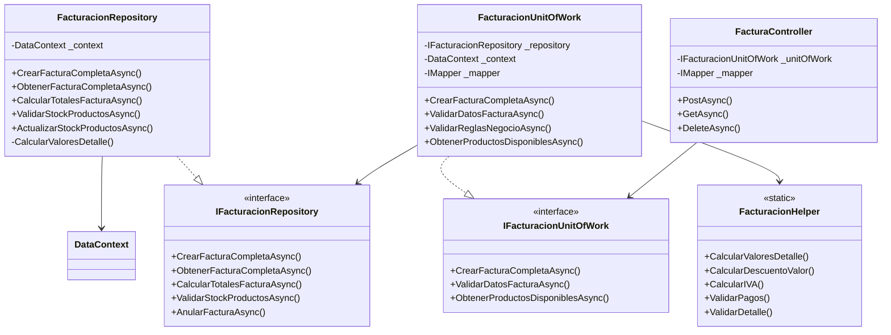

# 🛒 Sistema POS para Supermercado

<p align="center">


**Sistema de Punto de Venta (POS) moderno y escalable desarrollado con .NET 9**

[Características](#-características-principales) • [Tecnologías](#️-tecnologías-utilizadas) • [Arquitectura](#-arquitectura-del-sistema) • [Instalación](#-instalación) • [Documentación](#-documentación)

</p>

---

## 📑 Tabla de Contenidos

- [Introducción](#-introducción)
- [Objetivo General](#-objetivo-general)
- [Objetivos Específicos](#-objetivos-específicos)
- [Alcance del Proyecto](#-alcance-del-proyecto)
- [Plan de Trabajo](#-plan-de-trabajo)
- [Características Principales](#-características-principales)
- [Tecnologías Utilizadas](#️-tecnologías-utilizadas)
- [Arquitectura del Sistema](#-arquitectura-del-sistema)
- [Diagrama de Clases](#-diagrama-de-clases)
- [Estructura del Proyecto](#-estructura-del-proyecto)
- [Principios de Desarrollo](#-principios-de-desarrollo)
- [Instalación](#-instalación)
- [Documentación](#-documentación)
- [Autores](#-autores)

---

## 📖 Introducción

El **Sistema POS para Supermercado** es una solución integral desarrollada para modernizar y optimizar las operaciones de venta en establecimientos comerciales. Este sistema implementa las mejores prácticas para la gestión de inventario, facturación y control de usuarios con seguridad avanzada.

El proyecto surge de la necesidad de contar con una herramienta robusta que permita:

- **Gestión eficiente** de inventarios en tiempo real
- **Facturación electrónica** con cálculos automáticos de impuestos y descuentos
- **Control de usuarios** y roles con seguridad incorporada
- **Reportes y análisis** de ventas para la toma de decisiones
- **Integración flexible** con diferentes métodos de pago

Este sistema está diseñado para ser **mantenible, escalable y fácil de extender**, permitiendo adaptarse a las necesidades cambiantes del negocio.

---

## 🎯 Objetivo General

Desarrollar un **sistema de punto de venta (POS) robusto y escalable** para supermercados, que permita gestionar de manera eficiente las operaciones de ventas, inventario, facturación y control de usuarios.

---

## 🎯 Objetivos Específicos

### 1. 📦 Implementar un Módulo de Gestión de Inventario
- Desarrollar funcionalidades CRUD completas para productos, categorías y proveedores
- Implementar control de stock con alertas de niveles mínimos y máximos
- Gestionar tarifas de IVA asociadas a cada producto
- Proveer validaciones de negocio para garantizar la integridad de los datos

### 2. 🧾 Desarrollar un Sistema de Facturación Integral
- Implementar proceso de facturación con cálculos automáticos de:
  - Descuentos (por porcentaje o valor fijo)
  - Impuestos (IVA) sobre base gravable
  - Totales y subtotales
- Integrar múltiples métodos de pago (efectivo, tarjetas, transferencias)
- Generar consecutivos automáticos de facturación
- Validar disponibilidad de stock en tiempo real

### 3. 🔐 Crear un Sistema de Gestión de Usuarios y Seguridad
- Implementar autenticación y autorización basada en roles
- Gestionar permisos granulares por funcionalidad
- Registrar auditoría de operaciones críticas
- Proteger contraseñas con algoritmos de hashing seguros (BCrypt)

### 4. 🏗️ Establecer una Arquitectura Sólida y Escalable
- Aplicar arquitectura en capas (Repository Pattern, Unit of Work)
- Implementar los 5 principios SOLID en todo el código
- Utilizar inyección de dependencias para desacoplamiento
- Implementar manejo centralizado de errores y validaciones

### 5. 📊 Desarrollar Módulo de Reportes y Análisis
- Generar reportes de ventas por fecha, usuario y método de pago
- Implementar filtros avanzados para consultas de facturas
- Proveer resúmenes de ventas diarias
- Identificar facturas pendientes de pago

---

## 📋 Alcance del Proyecto

### ✅ Incluido en el Alcance Inicial

#### Módulos Principales:

1. **Gestión de Productos**
   - CRUD de productos con código de barras
   - Gestión de categorías de productos
   - Control de stock (actual, mínimo, máximo)
   - Asociación de tarifas de IVA

2. **Gestión de Terceros**
   - Registro de clientes y proveedores
   - Tipos de identificación (CC, NIT, CE, Pasaporte)
   - Información de contacto completa

3. **Sistema de Facturación**
   - Creación de facturas de venta
   - Detalles de factura con productos
   - Múltiples métodos de pago por factura
   - Cálculos automáticos (descuentos, IVA, totales)
   - Anulación de facturas con auditoría

4. **Gestión de Usuarios y Seguridad**
   - Autenticación y autorización
   - Roles (Admin, User)
   - Cifrado de contraseñas

5. **Configuración del Sistema**
   - Tipos de documentos
   - Consecutivos automáticos
   - Métodos de pago
   - Tarifas de IVA

#### Funcionalidades Técnicas:

- API RESTful completa
- Validaciones de negocio exhaustivas
- Transacciones de base de datos (ACID)
- DTOs para transferencia de datos
- AutoMapper para mapeo de objetos
- Helpers para cálculos reutilizables

### ❌ Fuera del Alcance Inicial

- Interfaz gráfica de usuario (Frontend)
- Integración con facturación electrónica DIAN
- Sistema de compras y órdenes de compra
- Gestión de empleados y nómina
- Integración con terminales de punto de venta físicos
- Reportes avanzados con gráficos
- Sistema de CRM (Customer Relationship Management)
- Aplicación móvil

---

## 🗓️ Plan de Trabajo

### Fase 1: Análisis y Diseño (2 semanas)
- Definición de requisitos funcionales y no funcionales
- Diseño de la base de datos (diagrama ER)
- Diseño de arquitectura del sistema
- Definición de DTOs y contratos de API
- Documentación de principios SOLID aplicados

### Fase 2: Configuración del Proyecto (1 semana)
- Creación de proyectos .NET 9
- Configuración de Entity Framework Core
- Configuración de AutoMapper
- Configuración de inyección de dependencias
- Configuración de Swagger/OpenAPI

### Fase 3: Desarrollo del Backend - Módulos Base (3 semanas)
- Implementación de entidades y DbContext
- Implementación de Repository Pattern
- Implementación de Unit of Work Pattern
- Desarrollo de módulos:
  - Gestión de Usuarios
  - Gestión de Roles
  - Gestión de Tipos de Identificación
  - Gestión de Terceros
  - Gestión de Categorías de Productos

### Fase 4: Desarrollo del Backend - Módulos de Inventario (2 semanas)
- Gestión de Tarifas de IVA
- Gestión de Productos
- Control de Stock
- Validaciones de negocio

### Fase 5: Desarrollo del Backend - Sistema de Facturación (3 semanas)
- Gestión de Tipos de Documentos
- Gestión de Consecutivos
- Gestión de Métodos de Pago
- Gestión de Movimientos
- Gestión de Facturas
- Detalles de Factura
- Pagos de Factura
- **FacturacionRepository** (proceso completo)
- Cálculos automáticos (descuentos, IVA, totales)
- Validaciones exhaustivas
- Anulación de facturas

### Fase 6: Helpers y Utilidades (1 semana)
- **FacturacionHelper** para cálculos
- Métodos de validación reutilizables
- Formateo de datos

### Fase 7: Pruebas y Validación (2 semanas)
- Pruebas unitarias de repositorios
- Pruebas de integración
- Validación de reglas de negocio
- Pruebas de API con Postman/Swagger

### Fase 8: Documentación y Entrega (1 semana)
- Documentación de código (XML Comments)
- Documentación de facturación
- Documentación de principios SOLID
- README del proyecto
- Manual de usuario de API

**Duración Total Estimada:** 15 semanas

---

## ⭐ Características Principales

### Seguridad Robusta
- Autenticación basada en usuarios y roles
- Cifrado de contraseñas con BCrypt
- Validación de permisos a nivel de operación
- Auditoría de operaciones críticas

### Gestión de Inventario Inteligente
- Control de stock en tiempo real
- Alertas de stock mínimo y máximo
- Gestión de categorías de productos
- Asociación de tarifas de IVA por producto

### Facturación Completa
- Cálculos automáticos de descuentos e impuestos
- Soporte para múltiples métodos de pago
- Consecutivos automáticos de facturación
- Anulación de facturas con trazabilidad
- Validación de stock antes de facturar

### Reportes y Consultas
- Resumen de ventas por fecha
- Consultas con filtros avanzados
- Facturas pendientes de pago
- Ventas por método de pago

### Arquitectura Profesional
- Implementación de principios SOLID
- Repository Pattern y Unit of Work
- Inyección de dependencias
- API RESTful bien documentada
- Manejo centralizado de errores

---

## 🛠️ Tecnologías Utilizadas

### Backend

| Tecnología | Versión | Propósito |
|------------|---------|-----------|
| **.NET** | 9.0 | Framework principal |
| **C#** | 13.0 | Lenguaje de programación |
| **Entity Framework Core** | 9.0 | ORM para acceso a datos |
| **SQL Server** | 2022 | Base de datos |
| **AutoMapper** | 13.0 | Mapeo de objetos |
| **BCrypt.Net** | Latest | Hash de contraseñas |
| **Swagger/OpenAPI** | Latest | Documentación de API |

### Patrones y Prácticas

- **Repository Pattern** - Abstracción de acceso a datos
- **Unit of Work Pattern** - Coordinación de transacciones
- **Dependency Injection** - Desacoplamiento de dependencias
- **DTO Pattern** - Transferencia de datos
- **SOLID Principles** - Código limpio y mantenible
- **Clean Architecture** - Separación de responsabilidades

---

## 🏗️ Arquitectura del Sistema

### Arquitectura en Capas

```
┌─────────────────────────────────────────────────────────────┐
│                      API Layer                              │
│                    (Controllers)                            │
│  • FacturaController                                        │
│  • ProductoController                                       │
│  • UsuarioController                                        │
│  • TerceroController                                        │
└─────────────────────────────────────────────────────────────┘
                         ↓
                         ↓
┌─────────────────────────────────────────────────────────────┐
│                  Business Logic Layer                       │
│                   (Unit of Work)                            │
│  • FacturacionUnitOfWork                                    │
│  • ProductoUnitOfWork                                       │
│  • UsuarioUnitOfWork                                        │
│  • Validaciones de negocio                                  │
└─────────────────────────────────────────────────────────────┘
                         ↓
                         ↓
┌─────────────────────────────────────────────────────────────┐
│                  Data Access Layer                          │
│                   (Repositories)                            │
│  • FacturacionRepository                                    │
│  • ProductoRepository                                       │
│  • UsuarioRepository                                        │
│  • GenericRepository<T>                                     │
└─────────────────────────────────────────────────────────────┘
                         ↓
                         ↓
┌─────────────────────────────────────────────────────────────┐
│                    Database Layer                           │
│                  (Entity Framework Core)                    │
│  • DataContext                                              │
│  • Migrations                                               │
│  • SQL Server Database                                      │
└─────────────────────────────────────────────────────────────┘

┌─────────────────────────────────────────────────────────────┐
│                    Cross-Cutting Concerns                   │
│  • DTOs (Data Transfer Objects)                             │
│  • Entities                                                 │
│  • Helpers (FacturacionHelper)                              │
│  • AutoMapper Profiles                                      │
└─────────────────────────────────────────────────────────────┘
```

### Flujo de una Operación de Facturación

```
1. Cliente HTTP Request (JSON)
          ↓
2. FacturaController recibe FacturaCompletaCreateDTO
          ↓
3. FacturacionUnitOfWork valida datos y reglas de negocio
          ↓
4. FacturacionRepository ejecuta la lógica de creación
          ↓
5. Transaction BEGIN
          ↓
6. Validar Stock de Productos
          ↓
7. Obtener Tipo de Documento y Consecutivo
          ↓
8. Calcular Totales (Bruto, Descuentos, IVA, Neto)
          ↓
9. Crear Movimiento
          ↓
10. Crear Factura
          ↓
11. Crear Detalles de Factura (con cálculo de IVA)
          ↓
12. Crear Pagos de Factura
          ↓
13. Actualizar Stock de Productos
          ↓
14. Actualizar Consecutivo
          ↓
15. Transaction COMMIT
          ↓
16. Obtener Factura Completa con relaciones
          ↓
17. Mapear a FacturaCompletaDTO
          ↓
18. Retornar ActionResponse<FacturaCompletaDTO>
          ↓
19. HTTP Response (JSON)
```

---

## 📊 Diagrama de Clases

### Diagrama de Clases Principal - Módulo de Facturación


### Diagrama de Clases - Arquitectura (Patrones)



---

## 📁 Estructura del Proyecto

```
SUPERMERCADO/
│
├── Supermercado.Backend/              # Proyecto principal de API
│   ├── Controllers/                   # Controladores de API REST
│   │   ├── FacturaController.cs
│   │   ├── ProductoController.cs
│   │   ├── UsuarioController.cs
│   │   └── ...
│   │
│   ├── Data/                          # Contexto de base de datos
│   │   ├── DataContext.cs
│   │   └── SeedDb.cs                  # Datos iniciales
│   │
│   ├── Helpers/                       # Clases auxiliares
│   │   └── FacturacionHelper.cs       # Cálculos y validaciones
│   │
│   ├── Mapping/                       # Configuración de AutoMapper
│   │   └── AutoMapperProfile.cs
│   │
│   ├── Migrations/                    # Migraciones de EF Core
│   │
│   ├── Repositories/                  # Capa de acceso a datos
│   │   ├── Interfaces/
│   │   │   ├── IGenericRepository.cs
│   │   │   ├── IFacturacionRepository.cs
│   │   │   └── ...
│   │   └── Implementations/
│   │       ├── GenericRepository.cs
│   │       ├── FacturacionRepository.cs
│   │       └── ...
│   │
│   ├── UnitsOfWork/                   # Lógica de negocio
│   │   ├── Interfaces/
│   │   │   ├── IGenericUnitOfWork.cs
│   │   │   ├── IFacturacionUnitOfWork.cs
│   │   │   └── ...
│   │   └── Implementations/
│   │       ├── GenericUnitOfWork.cs
│   │       ├── FacturacionUnitOfWork.cs
│   │       └── ...
│   │
│   ├── Program.cs                     # Punto de entrada
│   └── appsettings.json               # Configuración
│
├── Supermercado.Shared/               # Proyecto compartido
│   ├── DTOs/                          # Data Transfer Objects
│   │   ├── FacturacionDTOs.cs
│   │   ├── ProductoDTO.cs
│   │   ├── UsuarioDTO.cs
│   │   └── ...
│   │
│   ├── Entities/                      # Entidades del dominio
│   │   ├── Factura.cs
│   │   ├── Movimiento.cs
│   │   ├── Detalle_Factura.cs
│   │   ├── Producto.cs
│   │   ├── Usuario.cs
│   │   └── ...
│   │
│   └── Responses/                     # Respuestas estándar
│       └── ActionResponse.cs
│
├── Documentacion/                     # Documentación del proyecto
│   ├── DOCUMENTACION_FACTURACION.md
│   ├── APLICACION_PRINCIPIOS_SOLID.md
│   └── DOCUMENTACION_PATRONES_DISEÑO.md
│
└── README.md                          # Este archivo
```

---

## 🔧 Principios de Desarrollo

### Principios SOLID Aplicados

#### S - Single Responsibility Principle (Responsabilidad Única)

Cada clase tiene una única responsabilidad bien definida:
- `FacturaController`: Maneja peticiones HTTP
- `FacturacionUnitOfWork`: Coordina lógica de negocio
- `FacturacionRepository`: Accede a la base de datos
- `FacturacionHelper`: Provee utilidades de cálculo

Ejemplo:

```csharp
// Controlador - Solo maneja HTTP
public class FacturaController : ControllerBase
{
    [HttpPost]
    public async Task<IActionResult> PostAsync([FromBody] FacturaCompletaCreateDTO model)
    {
        var action = await _unitOfWork.CrearFacturaCompletaAsync(model);
        return Created($"/api/factura/{action.Result.FacturaId}", action.Result);
    }
}
```

#### O - Open/Closed Principle (Abierto/Cerrado)

Clases abiertas para extensión, cerradas para modificación:
- `GenericRepository<T>` es la base
- `FacturacionRepository` extiende sin modificar la base

Ejemplo:

```csharp
// Clase base - NO SE MODIFICA
public class GenericRepository<T> : IGenericRepository<T>
{
    public async Task<T> AddAsync(T entity) { /* ... */ }
}

// Extendemos para funcionalidad específica
public class FacturacionRepository : IFacturacionRepository
{
    // Métodos específicos de facturación
    public async Task<ActionResponse<FacturaCompletaDTO>> CrearFacturaCompletaAsync(...)
    {
        // Lógica compleja de facturación
    }
}
```

#### L - Liskov Substitution Principle (Sustitución de Liskov)

Las interfaces permiten sustituir implementaciones:

```csharp
// Cualquier implementación de IFacturacionRepository puede usarse
IFacturacionRepository repository = new FacturacionRepository(context);
```

#### I - Interface Segregation Principle (Segregación de Interfaces)

Interfaces específicas por responsabilidad:
- `IFacturacionRepository` - Solo métodos de facturación
- `IProductoRepository` - Solo métodos de productos
- `IUsuarioRepository` - Solo métodos de usuarios

#### D - Dependency Inversion Principle (Inversión de Dependencias)

Dependencias a través de abstracciones (interfaces), no implementaciones:

```csharp
public class FacturacionUnitOfWork
{
    // Dependemos de la interfaz, no de la implementación
    private readonly IFacturacionRepository _repository;
    
    public FacturacionUnitOfWork(IFacturacionRepository repository)
    {
        _repository = repository;
    }
}
```

---

## 🧩 Instalación

### Prerrequisitos
- [.NET 9 SDK](https://dotnet.microsoft.com/download/dotnet/9.0)
- [SQL Server 2022](https://www.microsoft.com/sql-server/sql-server-downloads) o superior
- [Visual Studio 2022](https://visualstudio.microsoft.com/) o [VS Code](https://code.visualstudio.com/)
- [Git](https://git-scm.com/)

### Pasos de Instalación

1) Clonar el repositorio

```bash
git clone https://github.com/KevinMT98/SUPERMERCADO_POS.git
cd SUPERMERCADO_POS
```

2) Configurar la cadena de conexión en `Supermercado.Backend/appsettings.json`

```json
{
  "ConnectionStrings": {
    "DefaultConnection": "Server=localhost;Database=SupermercadoDB;Trusted_Connection=True;TrustServerCertificate=True;"
  }
}
```

3) Restaurar paquetes NuGet

```bash
cd SUPERMERCADO/Supermercado.Backend
dotnet restore
```

4) Aplicar migraciones de base de datos

```bash
dotnet ef database update
```

5) Ejecutar el proyecto

```bash
dotnet run
```

6) Acceder a Swagger

Abre tu navegador en: `https://localhost:7xxx/swagger`

### Datos de Prueba

El sistema incluye un `SeedDb` que carga datos iniciales:

- Usuarios:
  - Admin: `admin` / `Admin123!`
  - SuperAdmin: `superadmin` / `Super123!`
  - Usuario: `usuario1` / `User123!`

- Productos de ejemplo:
  - Coca Cola 2L
  - Agua Cristal 600ml
  - Leche Entera 1L
  - Jabón Líquido 500ml
  - Arroz Blanco 1Kg

---

## 📚 Documentación

Documentación principal:

- [Documentación de Facturación](DOCUMENTACION_FACTURACION.md) — Proceso completo de facturación
- [Aplicación de Principios SOLID](APLICACION_PRINCIPIOS_SOLID.md) — Implementación de SOLID
- [Patrones de Diseño](DOCUMENTACION_PATRONES_DISEÑO.md) — Patrones utilizados

### Ejemplo de Uso — Crear una Factura

Request:

```json
POST /api/facturacion
Content-Type: application/json

{
  "terceroId": 1,
  "usuarioId": 1,
  "observaciones": "Venta mostrador",
  "detalles": [
    {
      "productoId": 1,
      "cantidad": 2,
      "precioUnitario": 15000.00,
      "descuentoPorcentaje": 10.0
    }
  ],
  "pagos": [
    {
      "metodoPagoId": 1,
      "monto": 27000.00,
      "referenciaPago": "Efectivo"
    }
  ]
}
```

Response:

```json
{
  "facturaId": 1,
  "numeroDocumento": "FV000001",
  "fecha": "2025-01-15T10:30:00",
  "nombreTercero": "Carlos Gómez",
  "totalBruto": 30000,
  "totalDescuentos": 3000,
  "totalImpuestos": 5130,
  "totalNeto": 32130,
  "detalles": [
    {
      "nombreProducto": "Coca Cola 2L",
      "cantidad": 2,
      "precioUnitario": 15000,
      "porcentajeIva": 19,
      "descuentoPorcentaje": 10,
      "descuentoValor": 3000,
      "subtotal": 32130
    }
  ],
  "pagos": [
    {
      "nombreMetodoPago": "Efectivo",
      "monto": 32130
    }
  ]
}
```

Cálculos de la factura:

```
Subtotal Bruto    = 2 × $15,000 = $30,000
Descuento (10%)   = $30,000 × 10% = $3,000
Base Gravable     = $30,000 - $3,000 = $27,000
IVA (19%)         = $27,000 × 19% = $5,130
Total Neto        = $27,000 + $5,130 = $32,130
```

---

## 👤 Autores

### Equipo de Desarrollo

| Nombre | Rol | GitHub |
|---|---|---|
| **Angel Tovar** | Developer | - |
| **Kevin Montaño** | Developer | [@KevinMT98](https://github.com/KevinMT98) |
| **Andres Felipe Yepes** | Developer | - |
| **Cristian Camilo Gutierrez** | Developer | - |

### Información Académica

- **Universidad:** ITM (Instituto Tecnológico Metropolitano)
- **Asignatura:** Tecnología en Desarrollo de Software
- **Fecha:** Octubre 2025
- **Versión:** 1.0

---

## 📄 Licencia

Este proyecto está bajo la Licencia MIT. Ver el archivo `LICENSE` para más detalles.

---

## 🤝 Contribuciones

Las contribuciones son bienvenidas. Por favor:

1. Haz fork del proyecto
2. Crea una rama para tu feature (`git checkout -b feature/AmazingFeature`)
3. Commit de tus cambios (`git commit -m 'Add some AmazingFeature'`)
4. Push a la rama (`git push origin feature/AmazingFeature`)
5. Abre un Pull Request

---

## 📫 Contacto

- GitHub: [@KevinMT98](https://github.com/KevinMT98)
- Repositorio: [SUPERMERCADO_POS](https://github.com/KevinMT98/SUPERMERCADO_POS)

---

<p align="center">
<strong>Si este proyecto te fue útil, por favor dale una estrella</strong><br/>
Desarrollado con ❤️ usando .NET 9<br/>
<em>Nota: Los diagramas Mermaid se conservan como bloques de código para su referencia en Word.</em>
</p>
